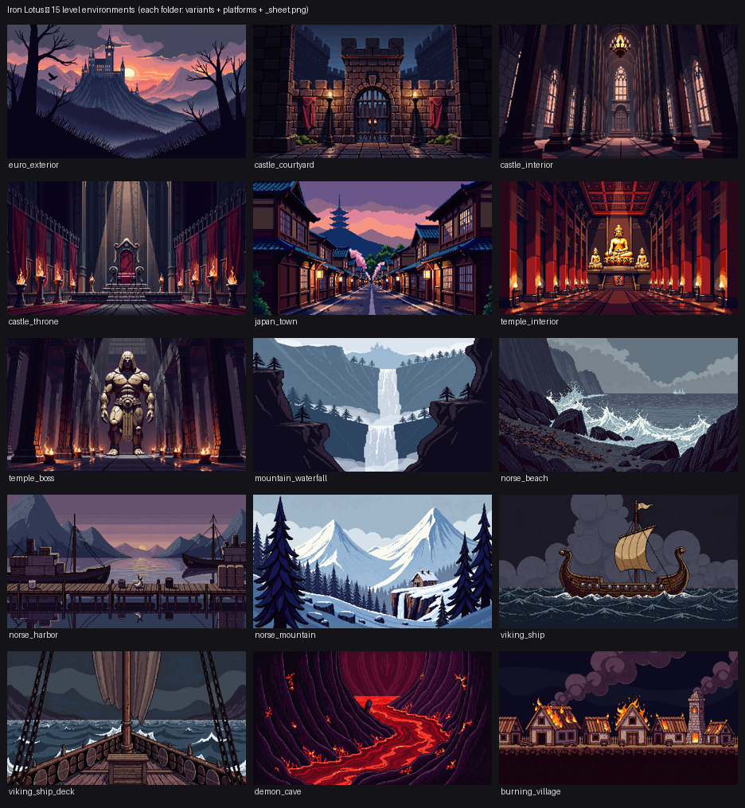
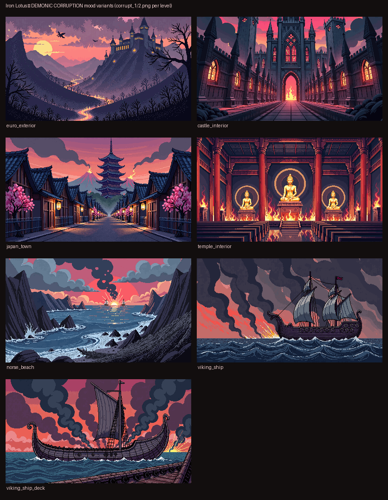

# Level Backgrounds & Platforms (PixelLab, overnight batch)

Generated art for the planned level environments — 15 environments, ~114
backdrops. Concept art to pick favorites from; not yet wired into any scene.

### All environments

### Demonic-corruption mood variants

## How to review
Open each level's **`_sheet.png`** — it shows the 3 background variants side by
side plus the themed jump-platforms on a checker (transparent) background.

## Levels
**The environments you asked for** (each 6 backdrop variants + platforms):
| Folder | Environment |
|---|---|
| `euro_exterior`   | European approach — colossal gothic castle looming in the distance |
| `castle_interior` | Inside the castle — great hall, columns, torchlight |
| `japan_town`      | Feudal Japan village street with a great pagoda temple behind |
| `temple_interior` | Inside the temple — golden statues, lacquered columns |
| `norse_beach`     | Scandinavian storm-battered rocky shore |
| `viking_ship`     | The longship seen from the side (establishing / parallax) |
| `viking_ship_deck`| ON the ship's deck, looking down toward the dragon prow (playable POV) |

**Bonus environments** (from the design doc + fitting the demon-war arcs; 4 variants each):
| Folder | Environment |
|---|---|
| `mountain_waterfall` | Feudal-East climb — tall vertical gorge + waterfall, distant castle |
| `castle_courtyard`   | Ruined courtyard / portcullis gate (bridges exterior→interior) |
| `norse_mountain`     | Snowbound Scandinavian pass, longhouse, frozen falls |
| `demon_cave`         | Hellish lava-rift cavern (the Demonic Scourge) |
| `burning_village`    | War-torn village ablaze at night |

**Boss arenas & connectives** (4 variants each):
| Folder | Environment |
|---|---|
| `castle_throne` | Castle throne-room boss arena — throne, braziers, war banners |
| `temple_boss`   | Temple inner sanctum — colossal stone guardian statue (env boss) |
| `norse_harbor`  | Fjord harbor/dock — moored longships (bridges beach→ship) |

**Mood variants:** each of the 7 core landscape levels also has `corrupt_1/2.png`
— a blood-sky / fire / smoke "demonic corruption" version (see `_overview_corrupted.png`).

---
**Total:** 15 environments, ~90 backdrops. Start at `_overview.png`, then open any
level's `_sheet.png`. Nothing is wired into scenes yet — tell me your favorites
per level and I'll set up the parallax + platforms in-engine.

## Files per level
- `backgrounds/<level>/bg_1.png … bg_6.png` — 400×224 parallax backdrops (6 seed variants).
- `backgrounds/<level>/_sheet.png` — review contact sheet (all variants + platforms).
- `platforms/<level>/*.png` — themed jump platforms, transparent background.
- `backgrounds/_overview.png` — one-look grid of a pick from every level.

## Notes / next steps
- Backgrounds are single-image backdrops. For true parallax we can later split
  or regenerate far/mid/near layers, or just scroll these slower than the
  foreground (the Abathor look in the design doc).
- Platforms are quick passes — some may need a cleaner side-on silhouette or
  tiling seams fixed. Tell me which per-level favorites you want and I'll
  refine + wire them into the levels.
- Tone target was dark/gritty to match Kageharu; say if any level should be
  moodier/brighter.
- Generator: `tools/bg_gen.py` (per-level prompts live there; easy to re-roll
  seeds or adjust a prompt and regenerate one level).
